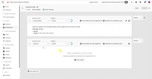

# Tutorials für [!DNL Journey Optimizer B2B Edition]

Erfahren Sie, wie Sie das Beste aus [!DNL Journey Optimizer B2B Edition] herausholen. Organisieren Sie Konto- und Käufergruppen-Journeys mithilfe integrierter generativer KI und branchenführender Automatisierung, um die Nachfrage nach spezifischen Angeboten zu maximieren.

## Neue Funktionen {#whats-new}

* [Einführung in Account Journey](/help/account-journeys/introducing-account-journeys.md)
  _Erfahren Sie alles über Account Journey und wie Sie sie verwenden können, um Ihre Audience zu erreichen._

* [Konto-Journey erstellen](/help/account-journeys/create-an-account-journey.md)
  _Erfahren Sie, wie Sie den Knoten „Account-Zielgruppe“, „Action-Knoten“, „Listener-Knoten“ und „Pfade aufteilen“ verwenden, um Account-Journey zu erstellen._

* [Aktionsknoten](/help/account-journeys/journey-nodes/action-node.md)
  _Erfahren Sie mehr über Aktionsknoten und deren Konfiguration beim Erstellen einer Konto-Journey._

* [Listener-Knoten](/help/account-journeys/journey-nodes/listen-node.md)
  _Erfahren Sie mehr über Listener-Knoten und deren Konfiguration beim Erstellen einer Account-Journey._

* [Split Account Journey](/help/account-journeys/journey-nodes/split-account-journey.md)
  _Erfahren Sie mehr über Aufspaltungs-/Zusammenführungspfadknoten und wie Sie diese beim Erstellen einer Konto-Journey konfigurieren können._

## Die beliebtesten Videos {#most-popular-videos}

<table>
<tr>
<td>

<a href="/help/buying-groups/buying-groups-overview.md"><strong>Einkaufsgruppen - Übersicht</strong></a>

</td>
<td>

<a href="/help/buying-groups/create-a-buying-group.md"><strong>Erstellen einer Einkaufsgruppe</strong></a>

</td>
<td>

<a href="/help/buying-groups/role-templates.md"><strong>Rollenvorlagen</strong></a>

</td>
</tr>
</table>
