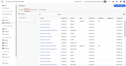

# Tutorials zu [!DNL Journey Optimizer B2B Edition]

Erfahren Sie, wie Sie das Beste aus [!DNL Journey Optimizer B2B Edition] herausholen. Organisieren Sie Konto- und Käufergruppen-Journeys mithilfe integrierter generativer KI und branchenführender Automatisierung, um die Nachfrage nach spezifischen Angeboten zu maximieren.

## Neue Funktionen {#whats-new}

* [Gruppen-Stadien kaufen](/help/main/buying-groups/buying-group-stages.md)
  _Erfahren Sie, wie Sie innerhalb eines Einzelstufenmodells mehrere Lebenszyklusphasen für Einkaufsgruppen erstellen und die Übergangsregeln angeben._

* [Auf AEP-Ereignisse warten](/help/main/account-journeys/journey-nodes/listen-for-aep-events.md)
  _Definieren und verwenden Sie ein beliebiges Erlebnisereignis auf Ihrer Konto-Journey._

* [Paid Media Orchestration](/help/main/account-journeys/journey-nodes/paid-media-orchestration.md)
  _Erfahren Sie, wie Sie mit einer Journey Personen in eine externe Zielgruppe verschieben können, die Sie dann an ein beliebiges unterstütztes Paid-Media-Ziel im AEP-Zielkatalog senden können._

## Die beliebtesten Videos {#most-popular-videos}

<table>
<tr>
<td>

<a href="/help/main/buying-groups/buying-groups-overview.md"><strong>Einkaufsgruppen - Übersicht</strong></a>

</td>
<td>

<a href="/help/main/buying-groups/create-a-buying-group.md"><strong>Erstellen einer Einkaufsgruppe</strong></a>

</td>
<td>

<a href="/help/main/buying-groups/role-templates.md"><strong>Rollenvorlagen</strong></a>

</td>
</tr>
</table>
